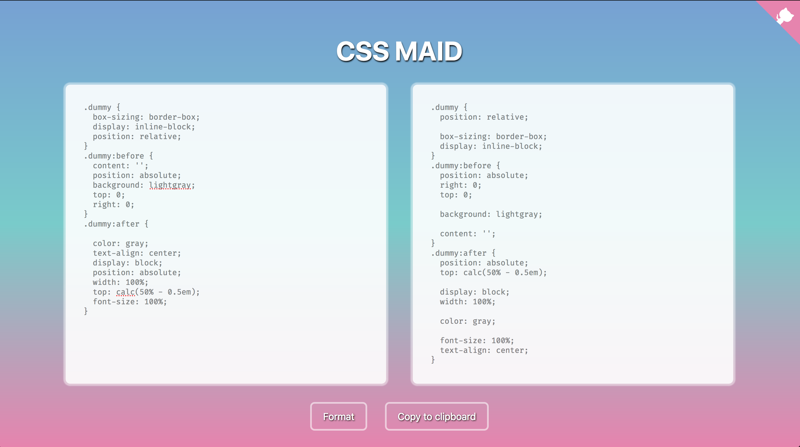

# CSS Maid

[](https://greenkeeper.io/)

[https://cssmaid.netlify.com/](https://cssmaid.netlify.com/)



### Huh?

Your CSS rules could look like this:

```
a:link, a:visited, a:hover, a:active {
  background-color: green;
  color: white;
  padding: 10px 25px;
  text-align: center;
  text-decoration: none;
  display: inline-block;
}
```

CSS Maid transforms it as follows:

```
a:link, a:visited, a:hover, a:active {
  display: inline-block;
  padding: 10px 25px;

  background-color: green;
  color: white;

  text-align: center;
  text-decoration: none;
}
```

We group properties by these types:

1.  Positioning
2.  Display
3.  Flex
4.  Color
5.  Font
6.  Grid
7.  Transition
8.  List
9.  Animation
10. Anything Else

## Support

Please [open an issue](https://github.com/DimitrisNL/css-maid/issues/new) for support.

## Contributing

Feel free to report any issues or provide any feedback you may have.

## Licence

MIT
